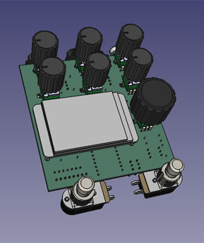
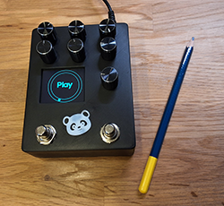
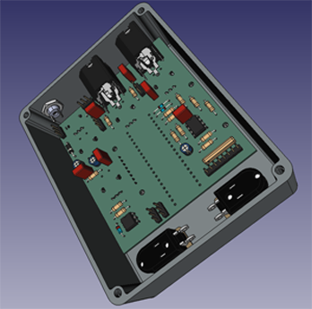

# PENDA: Platform for Effects oN DAisy

Welcome to the PENDA project! This repository contains the schematics and PCB layouts created with KiCad 8.0 for a versatile digital effects platform that utilizes the **Daisy-Seed** board from **ElectroSmith**.

  

## Author

DAD Design

## Overview / Features

PENDA is designed to provide a range of audio effects through a user-friendly interface. The platform includes:

- **Mono Input and Output**: Simplified connectivity for easy integration into your audio setup.
- **Momentary Footswitches**: Two footswitches for hands-free operation of effects.
- **2-inch SPI Display**: Featuring the ST7789 from Waveshare, providing a clear and compact user interface (other display options are available).
- **MIDI Input**: Allows for easy integration with MIDI controllers and other devices.
- **Control Options**:
  - **4 Encoders with Pushbutton**: For easy parameter adjustment and selection.
  - **3 Analog Potentiometers**: To control input levels and the Dry/Wet mix.
- **Fully Analog Dry Circuit**: Ensures a high-quality dry signal path, maintaining the integrity of your original sound.

## Content

The **Fab** directory contains all the necessary files for fabrication.
The **PENDA** directory contains the source files for KiCad 8.0.

## Contributing

We welcome contributions to the PENDA project! If you have suggestions or improvements, please open an issue or submit a pull request.

## License

This project is licensed under the MIT License.

